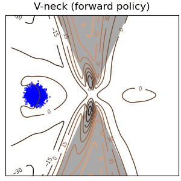

# Deep Generalized Schrödinger Bridge <br>[[NeurIPS 2022 Oral](https://arxiv.org/abs/2209.09893)]

Official PyTorch implementation of the paper
"_<ins>**Deep**</ins> <ins>**G**</ins>eneralized <ins>**S**</ins>chrödinger <ins>**B**</ins>ridge_ (**DeepGSB**)" which introduces
a new class of diffusion models as a scalable numerical solver for Mean-Field Games (MFGs), _e.g._, population modeling & opinion depolarization, with hard distributional constraints.


<table>
  <tr>
    <td colspan="3" align='center'><b>Population modeling (crowd navigation)</b></td>
    <td colspan="2" align='center'><b>Opinion depolarization</b></td>
  </tr>
  <tr>
    <td></td>
    <td></td>
    <td></td>
    <td></td>
    <td></td>
  </tr>
</table>

This repo is co-maintained by [Guan-Horng Liu](https://ghliu.github.io/), [Tianrong Chen](https://tianrongchen.github.io/), and [Oswin So](https://oswinso.xyz/). Contact us if you have any questions! If you find this library useful, please cite :arrow_down:
```
@inproceedings{liu2022deep,
  title={Deep Generalized Schr{\"o}dinger Bridge},
  author={Liu, Guan-Horng and Chen, Tianrong and So, Oswin and Theodorou, Evangelos A},
  booktitle={Advances in Neural Information Processing Systems},
  year={2022}
}
```


## Install

Install the dependencies with [Anaconda](https://www.anaconda.com/products/individual) and activate the environment `deepgsb` with
```bash
conda env create --file requirements.yaml
conda activate deepgsb
```


## Run & Evaluate

The repo contains 2 classes of Mean-Field Games, namely
- **population modeling**: `GMM`, `Vneck`, `Stunnel`
- **opinion depolarization**: `opinion`, `opinion-1k` (dim=1000).

The commands to generate similar results shown in our paper can be found in `run.sh`. Results, checkpoints, and tensorboard log files will be saved respectively to the folders `results/`, `checkpoint/`, and `runs/`.
```bash
bash run.sh <problem> # <problem> can be {GMM, Vneck, Stunnel, opinion, opinion-1k}
```

You can visualize the trained DeepGSB policies by making gif animation
```bash
python make_animation.py --load <path to checkpoint npz> --name <gif name>
```

## Structure

We briefly document the file structure to ease the effort if you wish to integrate DeepGSB with your work flow.
```bash
deepgsb/
├── deepgsb.py       # the DeepGSB MFG solver
├── sb_policy.py     # the parametrized Schrödinger Bridge policy
├── loss_lib.py      # all loss functions (IPF/KL, TD, FK/grad)
├── eval_metrics.py  # all logging metrics (Wasserstein, etc)
├── replay_buffer.py
└── util.py
mfg/
├── mfg.py           # the Mean-Field Game environment
├── constraint.py    # the distributional boundary constraint (p0, pT)
├── state_cost.py    # all mean-field interaction state costs (F)
├── sde.py           # the associated stochastic processes (f, sigma)
├── opinion_lib.py   # all utilities for opinion depolarization MFG
├── plotting.py
└── util.py
models/              # the deep networks for parametrizing SB policy
configs/             # the configurations for each MFG
```
